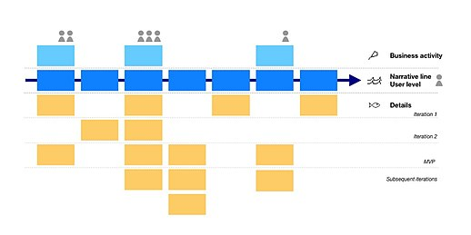

## Project title
sequelize story teller
If you want to build a webpage using sequelize follow my easy to follow story
## Motivation
I wanted to use more javascript instead of mysql to build my database.
## Screenshots

## Tech/framework used
node
<b>Built with</b>
- [Electron](https://electron.atom.io)

## How to use?
When user views my Develop folder they will get a step by step process to build a webpage using my sql
When the user finishes viewing my story they can find additional information to help
build their webpage with a more efficient code

## Contribute

Please feel free contritbute to my project by contacting me  A [contributing guideline](https://www.linkedin.com/in/chidi-ekeke-038609172/
## Credits

## License
Javascript, Html, Jquery, Node, Sequelize

MIT © [Chidi Ekeke]()